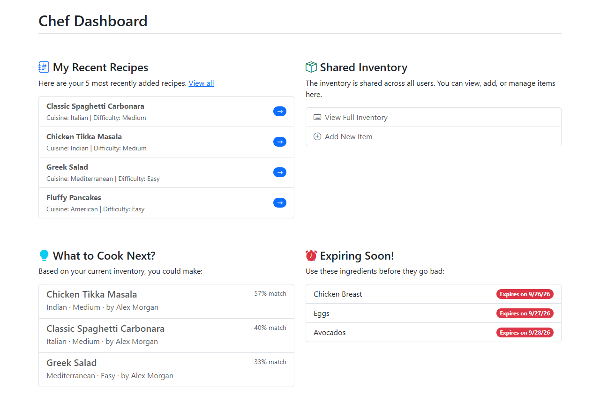
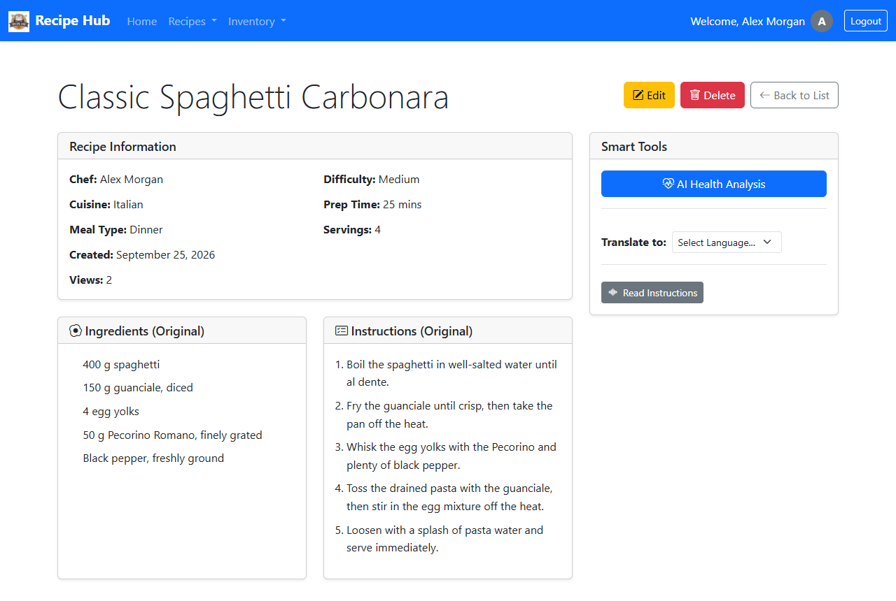
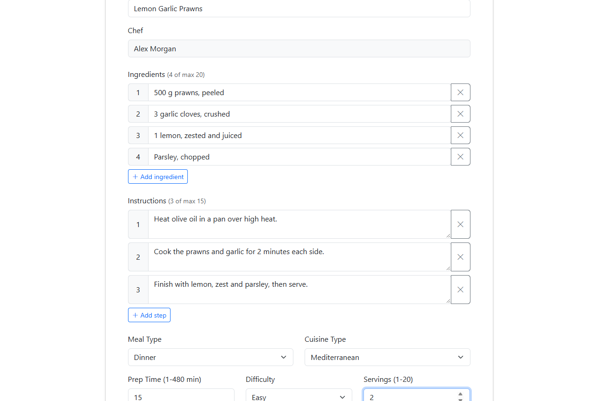
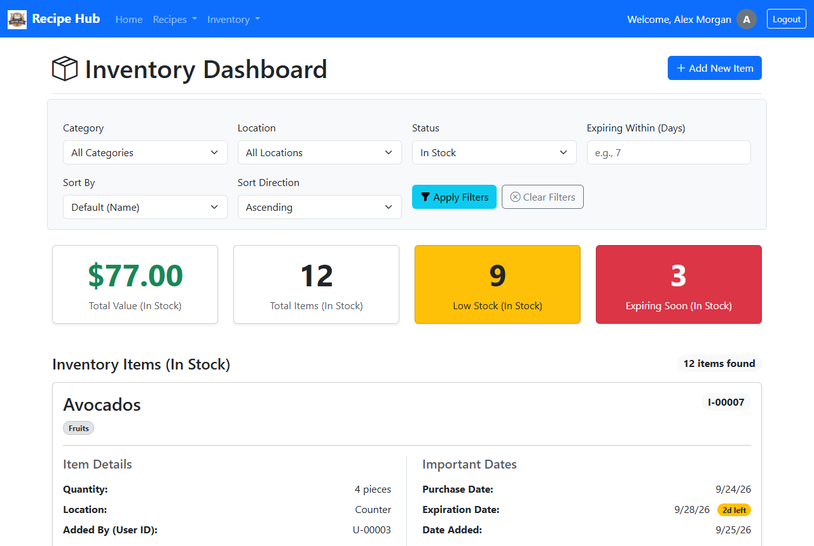
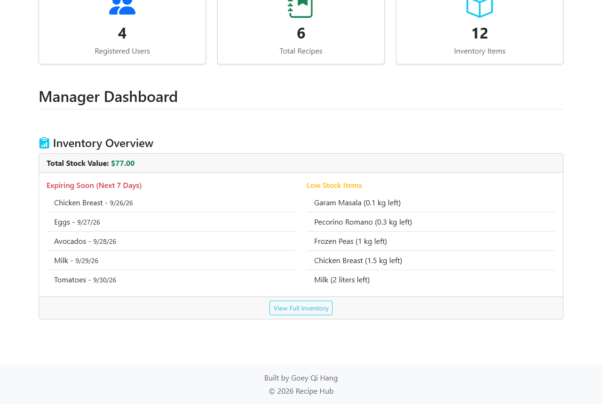
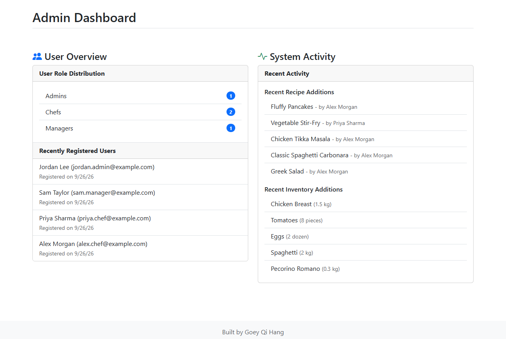
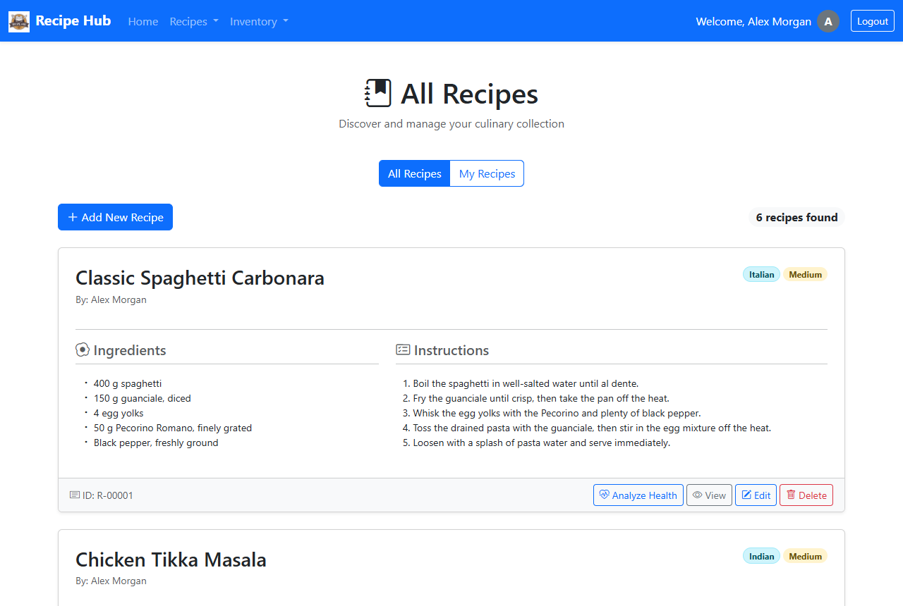
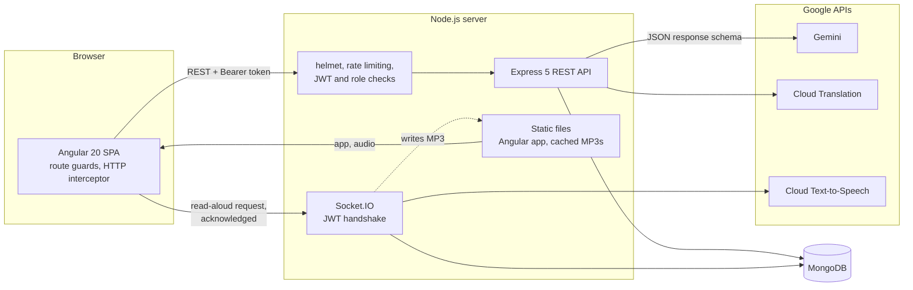

<p align="center">
  
</p>

<h1 align="center">Recipe Hub</h1>

<p align="center">
  A full-stack recipe and kitchen-inventory manager with role-based dashboards,<br>
  AI health analysis, recipe translation and read-aloud instructions.
</p>

<p align="center">
  <a href="https://github.com/goeyqihang/RecipeHub/actions/workflows/ci.yml"></a>
  <a href="https://angular.dev/"></a>
  <a href="https://nodejs.org/"></a>
  <a href="https://expressjs.com/"></a>
  <a href="https://mongoosejs.com/"></a>
  <a href="https://socket.io/"></a>
  <a href="LICENSE"></a>
</p>

<p align="center">
  <a href="#getting-started">Getting started</a> ·
  <a href="#architecture">Architecture</a> ·
  <a href="docs/API.md">API reference</a> ·
  <a href="#testing">Testing</a>
</p>

## Screenshots

<table>
  <tr>
    <td width="50%"><br><sub><b>Chef dashboard:</b> recipes you can cook with what's in stock, and ingredients about to expire</sub></td>
    <td width="50%"><br><sub><b>Recipe details:</b> AI health analysis, translation and read-aloud in one place</sub></td>
  </tr>
  <tr>
    <td width="50%"><br><sub><b>Recipe form:</b> one input per ingredient and step, added and removed on the fly</sub></td>
    <td width="50%"><br><sub><b>Inventory:</b> stock value, low-stock and expiry alerts, filters and sorting</sub></td>
  </tr>
</table>

<details>
<summary>More screenshots</summary>
<br>
<table>
  <tr>
    <td width="50%"><br><sub><b>Manager dashboard:</b> stock value, expiring and low-stock items</sub></td>
    <td width="50%"><br><sub><b>Admin dashboard:</b> users per role and recent activity</sub></td>
  </tr>
  <tr>
    <td width="50%"><br><sub><b>Recipe list:</b> everyone's recipes, or only yours</sub></td>
    <td width="50%"></td>
  </tr>
</table>
</details>

## Features

- **Three roles, three dashboards.** Chefs see their latest recipes, ingredients expiring in the next 3 days, and "what to cook next" suggestions ranked by how many of a recipe's ingredients are in stock. Managers see total stock value, items expiring within a week and low-stock items. Admins see users per role and the newest users, recipes and inventory items. Dashboards refresh every 30 seconds.
- **Recipes.** Chefs create, browse, edit and delete recipes, switch between all recipes and their own, and only the author can change a recipe. Each recipe counts its views.
- **AI health analysis.** Google Gemini reviews a recipe's ingredients and returns a summary, potential health concerns, and three concrete suggestions for making it healthier.
- **Translation.** Translate a recipe's title, ingredients and steps into Spanish, Italian, French or Chinese with Google Cloud Translation.
- **Read aloud.** Turn a recipe's instructions into speech with Google Cloud Text-to-Speech, with play, pause, stop and volume controls.
- **Shared kitchen inventory.** Track quantity, unit, category, storage location, cost, and purchase and expiry dates. Filter by category, location, status or "expiring within N days", sort by name, dates, quantity, cost, category or location, and mark used items as *Consumed* or *Wasted* to keep a history (or delete data-entry mistakes outright).
- **Installable.** Production builds register the Angular service worker and include a web app manifest, so browsers offer to install the app.

## Architecture



The Express server serves both the built Angular app and the API from one origin, so there is no CORS to configure.

### Engineering highlights

- **Stateless JWT authentication.** Passwords are hashed with bcrypt and never leave the server. Logging in returns a signed JWT, which an Angular HTTP interceptor attaches to every API call; if the API rejects it (for example because it expired), the interceptor logs the user out. The same token authenticates Socket.IO connections. Roles are enforced on both sides: route guards in the client, middleware on the server, including an ownership check so only a recipe's author can change it.
- **Structured AI output.** The Gemini request declares a JSON response schema (summary, concerns, suggestions), so the reply parses directly into the shape the UI renders. The server still validates it before passing it on, and it analyzes the stored recipe rather than data sent by the client.
- **Cached read-aloud over Socket.IO.** The client asks for a recipe's audio over an authenticated socket and gets the MP3 URL back as an acknowledgement, with a timeout so the UI never hangs. Files are named by a SHA-256 hash of the voice and text, so repeat requests skip the Text-to-Speech API. Files are written atomically and deleted after a day without use.
- **Validation on both ends.** The recipe form is a reactive form whose ingredient and step lists are `FormArray`s, so entries can contain commas. Its rules mirror the Mongoose schemas, which enforce them again on the server. The API also whitelists writable fields, so clients can't set IDs, owners or view counts.
- **Hardened API.** helmet sets a Content-Security-Policy and other security headers, login and registration are rate-limited per IP, query objects in login payloads are rejected, and errors come back as JSON without stack traces.
- **Tested.** Backend integration tests (Jest + Supertest against a real MongoDB, with Google APIs mocked) and Angular unit tests, run by GitHub Actions on every push.

## Tech stack

| Layer | Technologies |
| --- | --- |
| Frontend | Angular 20 (standalone components, reactive and template-driven forms, RxJS), Bootstrap 5, ng-bootstrap, Bootstrap Icons, Angular service worker |
| Backend | Node.js, Express 5, Socket.IO 4, Mongoose 8, jsonwebtoken, bcryptjs, helmet, express-rate-limit |
| Database | MongoDB |
| AI and cloud | Google Gemini (`gemini-2.5-flash`), Google Cloud Translation, Google Cloud Text-to-Speech |
| Testing and CI | Jest, Supertest, Jasmine, Karma, GitHub Actions |

## Getting started

### Prerequisites

- **Node.js** 20.19+, 22.12+ or 24+ (required by Angular 20)
- **MongoDB**, either [installed locally](https://www.mongodb.com/try/download/community) or hosted (for example MongoDB Atlas)
- *Optional:* a Gemini API key and a Google Cloud service account for the AI features (see [Google services](#google-services)). Everything else works without them.

### Install and run

```bash
npm install
cp .env.example .env    # then set JWT_SECRET, and the Google keys if you have them
npm run build           # build the Angular app into dist/
npm start               # start the server
```

Open <http://localhost:8080>, register an account and log in. Pick the **Chef** role to try the recipe features.

### Development workflow

Run these in two terminals, then refresh the browser after each rebuild:

```bash
npm run watch   # rebuild the Angular app whenever a frontend file changes
npm run dev     # run the server with nodemon, restarting on backend changes
```

## Configuration

Settings come from environment variables. On startup the server also loads a `.env` file from the project root if there is one; variables set in the shell take precedence. Start from [`.env.example`](.env.example).

| Variable | Default | Purpose |
| --- | --- | --- |
| `PORT` | `8080` | Port the server listens on |
| `MONGO_URI` | `mongodb://127.0.0.1:27017/recipeHubDB` | MongoDB connection string |
| `JWT_SECRET` | random at startup | Secret for signing login tokens. Set it, or every restart logs everyone out |
| `JWT_EXPIRES_IN` | `7d` | How long a login stays valid |
| `AUTH_RATE_LIMIT` | `20` | Login and registration requests allowed per IP every 15 minutes |
| `GEMINI_API_KEY` | *(none)* | Enables the AI health analysis |
| `GOOGLE_APPLICATION_CREDENTIALS` | *(none)* | Path to a Google Cloud service-account key (JSON); enables translation and read-aloud |

### Google services

1. **Gemini:** create an API key in [Google AI Studio](https://aistudio.google.com/) and set `GEMINI_API_KEY`.
2. **Translation and Text-to-Speech:** in a Google Cloud project, enable the *Cloud Translation API* and the *Cloud Text-to-Speech API*, create a service account, download a JSON key for it, and set `GOOGLE_APPLICATION_CREDENTIALS` to the key's path, for example `./credentials/service-account.json`.

If a service isn't configured, the server logs a warning at startup and the matching feature shows an error message instead of results. `.env`, `credentials/` and service-account key files are git-ignored.

## Testing

```bash
npm test                # both suites
npm run test:backend    # Jest + Supertest
npm run test:frontend   # Karma with headless Chrome
```

- **Backend:** integration tests for authentication (hashing, tokens, expiry, rate limiting), recipes (arrays, ownership, field whitelisting, unique titles), inventory, dashboards and the read-aloud socket. They need a running MongoDB, `mongodb://127.0.0.1:27017` by default or `MONGO_TEST_URI`. Each test file works in its own temporary database and drops it afterwards. Google APIs are mocked.
- **Frontend:** unit tests for the auth service, HTTP interceptor, route guards, the recipe form and every component. They need Chrome.
- **CI:** [`.github/workflows/ci.yml`](.github/workflows/ci.yml) builds the app and runs both suites on every push and pull request, with MongoDB as a service container.

## Project structure

```text
recipeHub/
├── backend/
│   ├── server.js           # Entry point: HTTP server, Socket.IO, MongoDB connection
│   ├── app.js              # Express app: security middleware, API routes, static files
│   ├── config.js           # Settings from .env and the environment
│   ├── tokens.js           # Signs and verifies login tokens (JWT)
│   ├── controllers/        # Request handlers: users, dashboard, recipes, inventory
│   ├── middleware/auth.js  # Token, role and recipe-ownership checks
│   ├── models/             # Mongoose schemas: User, Recipe, InventoryItem, Counter
│   ├── routes/             # Express routers
│   ├── services/           # Text-to-speech with the audio cache
│   ├── sockets/            # Socket.IO read-aloud handler
│   └── tests/              # Jest + Supertest integration tests
├── src/app/
│   ├── components/         # Pages: auth, dashboards, recipes, inventory, layout, error pages
│   ├── constants/          # API base path, dropdown options, validation rules
│   ├── guard/              # Route guards: logged in, logged out, role, recipe owner
│   ├── interceptors/       # Adds the login token to API requests
│   ├── models/             # TypeScript interfaces
│   └── services/           # HTTP and Socket.IO clients
├── public/                 # Logo, favicon, PWA icons and web app manifest
├── docs/                   # API reference and screenshots
├── .github/workflows/      # CI
└── .env.example            # Template for local configuration
```

## License

[MIT](LICENSE)
